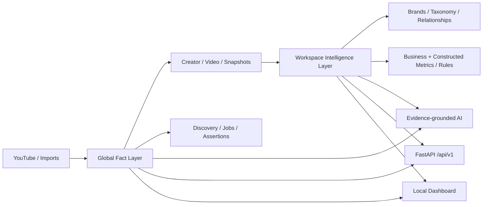

# YouTube Creator Intelligence Hub

**Local-first Creator Intelligence platform built with Python, SQLite, FastAPI and an optional evidence-grounded AI layer.**

[](https://github.com/Nikolaustis/YouTube_Creator_Data_Hub/actions/workflows/ci.yml)

The project turns YouTube Creator/Video facts into a reusable intelligence system: discovery, monitoring, human review, Workspace-specific brand/taxonomy semantics, commercial metrics, constructed metrics, durable jobs, exports and auditable AI outputs. Private business data is deliberately kept outside Git.

## 60-second public demo

Windows:

```bat
setup-demo.cmd
start-demo.cmd
```

The demo creates a deterministic **synthetic** SQLite database. It never reads or modifies the production database. For the typed API and OpenAPI documentation:

```bat
start-api.cmd
```

Open `http://127.0.0.1:8766/docs`.

## Architecture



### Global Fact Layer

Creator, Video, snapshots, discovery provenance, durable job runs, run specifications, assertions and AI evidence are reusable facts.

### Workspace Intelligence Layer

Brands, brand groups, taxonomies, Creator relationships, business metric definitions, discovery profiles, secondary metrics, rules and saved views belong to a Workspace. New reusable surfaces use Workspace semantics; historical Dashboard aliases are retained behind an explicit legacy compatibility boundary during migration.

## Engineering highlights

- **SQLite local-first fact store** with schema migration, consistent backup/restore and data-source provenance.
- **Workspace architecture** separates stable facts from project-specific business semantics.
- **Durable Job Engine** supports resource queues, cancel/retry, checkpoints and restart recovery; persistence degradation is surfaced through health state instead of being silently swallowed.
- **FastAPI + Pydantic** provides typed `/api/v1`, Swagger/ReDoc and OpenAPI for new integrations. The historical Dashboard HTTP server remains a compatibility layer while routes migrate.
- **Server-side aggregation** avoids pushing the raw video corpus into the browser; Dashboard builders batch-load facts and cache derived assets.
- **Evidence-grounded AI** keeps `fact / derived / ai / human` provenance separate and supports repeatable Run Specifications.
- **Synthetic demo, benchmark and AI-evaluation harnesses** let reviewers validate the project without access to private data.
- **CI on Windows + Ubuntu** tests multiple Python versions, portability rules and offline AI-evaluation contracts.

## Neutral-surface status

V4.2 completes the **neutral public/default surface**. The active generic Workspace no longer inherits unscoped historical metrics, browser state is Workspace-scoped, default Dashboard columns and examples are domain-neutral, and compatibility templates are hidden from the public template catalog. Historical compatibility data is preserved in an opt-in compatibility Workspace instead of being auto-activated.

## Reproducible evidence

### Benchmark

```bash
python -m creator_hub.portfolio.benchmark --profile small
python -m creator_hub.portfolio.benchmark --profile medium --json benchmarks/results/medium.json
```

Do not publish invented numbers. Commit results only after recording machine/Python/profile information.

### AI evaluation

```bash
python -m creator_hub.portfolio.ai_eval
python -m creator_hub.portfolio.ai_eval --outputs evals/results/model_outputs.jsonl
```

The evaluator reports structured-output rate, evidence coverage and unsupported-claim flags. The default CI mode is fully offline.

## Development

```bash
pip install -r requirements-dev.txt
pytest
ruff check creator_hub/api creator_hub/portfolio creator_hub/compat creator_hub/jobs.py creator_hub/monitoring.py creator_hub/field_registry.py creator_hub/ai/local_tools.py tests scripts/check_core_portability.py scripts/check_public_surface_neutrality.py scripts/neutralize_public_surface.py scripts/repo_hygiene.py
python scripts/check_core_portability.py
python scripts/check_public_surface_neutrality.py
```

## Main commands

```text
start-dashboard.cmd   Existing full interactive Dashboard (compatibility server)
start-api.cmd         Typed FastAPI / OpenAPI surface
setup-demo.cmd        Install runtime dependencies + generate synthetic data
create-demo.cmd       Regenerate deterministic synthetic data
start-demo.cmd        Open the full Dashboard on synthetic data
run-benchmark.cmd     Run a reproducible small benchmark
run-ai-eval.cmd       Run offline AI grounding evaluation
```

## Data safety

Git must not contain production SQLite files, API keys, exports, backups, logs, caches, business CSV/XLSX files or virtual environments. `.gitignore` enforces the common cases and the upgrade script removes historical `__pycache__`, `.pyc` and obsolete patch artifacts.

## Documentation

- `docs/PORTFOLIO.md` — reviewer/portfolio workflow
- `docs/API_FASTAPI.md` — typed API migration
- `docs/ARCHITECTURE.md` — system architecture
- `docs/DATA_CONTRACT.md` — fact/derived/AI/human precedence
- `docs/BENCHMARKS.md` — performance evidence policy
- `docs/AI_EVALUATION.md` — grounding evaluation
- `docs/OPERATIONS.md` — production operations
- `docs/WORKSPACES.md` — Workspace model
- `docs/RELEASE_NOTES_4.2.0.md` — neutral-surface migration notes

## Version

`4.2.0` · Database Schema remains `18`; this release changes presentation/config scoping, not production Creator/Video facts.
